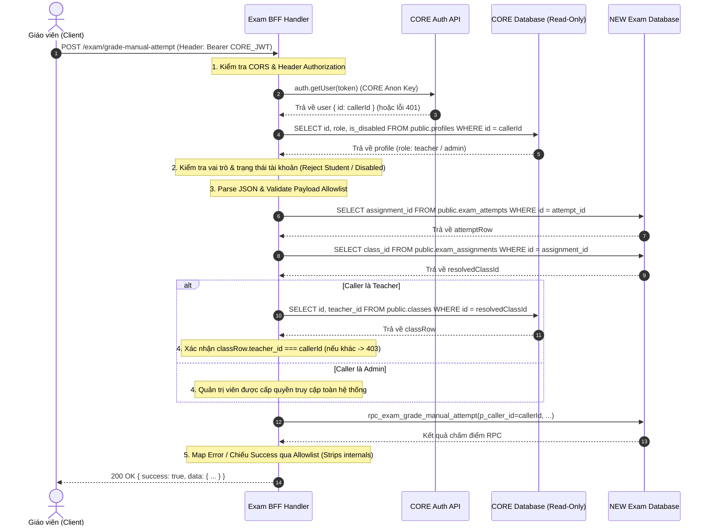

# EXAM BUILDER V1 — PHASE 3A ARCHITECTURAL DESIGN & SPECIFICATION
## BFF Security Foundation + Manual Grading Endpoint (Local Design & Unit Tests)

---

### 1. TỔNG QUAN VÀ MỤC TIÊU (Overview & Goal)

Tài liệu này đặc tả kiến trúc bảo mật Two-Project Architecture và endpoint BFF đầu tiên của Exam Builder V1:
- **Endpoint**: `POST /exam/grade-manual-attempt` (Edge Function: `exam-grade-manual-attempt`)
- **Mục tiêu**: Thiết lập đường dẫn bảo mật phân quyền nghiêm ngặt giữa trình duyệt người dùng (Browser), cơ sở dữ liệu CORE (`nddimmxpymipalpxlops`), và cơ sở dữ liệu NEW Exam Builder (`szptvqkoiphrhlionfoh`).

```
+------------------+         +-------------------------------+         +-----------------------+
|  Browser Client  | ------> |     Exam Builder BFF          | ------> |     NEW Database      |
|  (CORE JWT)      |         |  (Two-Project Security Hub)   |         | (szptvqkoiphrhlionfoh)|
+------------------+         +-------------------------------+         +-----------------------+
                                     |                    ^
                                     | (Verify JWT/Role)  | (Fetch Class/Ownership)
                                     v                    |
                             +-------------------------------+
                             |         CORE Database         |
                             |     (nddimmxpymipalpxlops)    |
                             +-------------------------------+
```

---

### 2. RANH GIỚI TIN CẬY (Trust Boundaries)

| Dữ liệu / Thuộc tính | Trạng thái tin cậy | Nguồn xác thực | Cơ chế bảo vệ |
| :--- | :--- | :--- | :--- |
| `caller_id` trong Body | **KHÔNG TIN CẬY (UNTRUSTED)** | Bị cấm hoàn toàn | Bị reject ngay lập tức (`400 INVALID_REQUEST_FIELD`) |
| `role` / `is_admin` trong Body | **KHÔNG TIN CẬY (UNTRUSTED)** | Bị cấm hoàn toàn | Bị reject ngay lập tức (`400 INVALID_REQUEST_FIELD`) |
| `class_id` trong Body | **KHÔNG TIN CẬY (UNTRUSTED)** | Bị cấm hoàn toàn | Bị reject ngay lập tức (`400 INVALID_REQUEST_FIELD`) |
| `service_role_key` trong Body | **KHÔNG TIN CẬY (UNTRUSTED)** | Bị cấm hoàn toàn | Bị reject ngay lập tức (`400 INVALID_REQUEST_FIELD`) |
| Danh tính Caller (`callerId`) | **TIN CẬY SAU XÁC THỰC** | CORE `auth.getUser()` | Trích xuất trực tiếp từ JWT sau khi kiểm tra chữ ký số |
| Vai trò người dùng (`actorRole`)| **TIN CẬY SAU XÁC THỰC** | CORE `public.profiles` | Đọc bằng CORE Service Role Key (Read-Only) |
| Quyền quản lý lớp (`teacher_id`) | **TIN CẬY SAU XÁC THỰC** | CORE `public.classes` | Đối soát `classes.teacher_id === callerId` (Read-Only) |
| Chuỗi `attempt -> class_id` | **TIN CẬY SAU XÁC THỰC** | NEW `exam_attempts` & `exam_assignments` | Phân giải hoàn toàn phía Server-Side |
| NEW `service_role` Key | **BÍ MẬT TUYỆT ĐỐI (SECRET)** | Biến môi trường Server | Tồn tại duy nhất phía Server, không bao giờ lộ ra Client |

---

### 3. QUY TRÌNH XÁC THỰC & PHÂN QUYỀN (Auth & Authorization Flow)



---

### 4. ĐẶC TẢ GIAO THỨC REQUEST & RESPONSE

#### 4.1. Request Contract
- **Method**: `POST`
- **Header bắt buộc**: `Authorization: Bearer <CORE_ACCESS_TOKEN>`
- **Content-Type**: `application/json`
- **Body Schema**:
```json
{
  "attempt_id": "77777777-7777-4777-8777-777777777701",
  "expected_version": 1,
  "manual_grades": [
    {
      "exam_question_id": "98888888-8888-4888-8888-888888888802",
      "points_earned": 3.0,
      "teacher_comment": "Phân tích sâu sắc, lập luận chặt chẽ."
    }
  ],
  "teacher_feedback": "Em làm bài rất tốt, cần phát huy."
}
```

*Quy tắc kiểm tra nghiêm ngặt (Strict Validation Rules):*
- Chỉ chấp nhận 4 khóa cấp cao: `attempt_id`, `expected_version`, `manual_grades`, `teacher_feedback`.
- Mọi trường bổ sung hoặc tiêm nhiễm (`caller_id`, `role`, `class_id`, `is_admin`, `student_id`) đều bị từ chối (`400 INVALID_REQUEST_FIELD`).
- `points_earned`: Phải là số thực không âm hữu hạn, tối đa 2 chữ số thập phân.

#### 4.2. Response Contract (Success Projection Allowlist)
- **HTTP Status**: `200 OK`
- **Body**:
```json
{
  "success": true,
  "data": {
    "attempt_id": "77777777-7777-4777-8777-777777777701",
    "status": "graded",
    "objective_score": 2.5,
    "manual_score": 7.0,
    "total_score": 9.5,
    "max_score": 10.0,
    "teacher_feedback": "Em làm bài rất tốt, cần phát huy.",
    "graded_at": "2026-09-06T00:34:05.135490+00:00",
    "graded_by": "a1111111-1111-4111-8111-111111111111",
    "reward_stars_awarded": 0,
    "version": 7,
    "idempotent_replay": false
  }
}
```
*Cam kết bảo mật*: Tuyệt đối không để lộ đáp án (`correct_answer`, `answer_key`), cấu hình chấm thi nội bộ, hoặc thông tin Service Role Key.

---

### 5. BẢNG ÁNH XẠ MÃ LỖI (Domain Error to HTTP Status Mapping)

| HTTP Status | Error Code (`error_code`) | Ý nghĩa & Tình huống kích hoạt |
| :--- | :--- | :--- |
| **401 Unauthorized** | `AUTH_REQUIRED` | Thiếu hoặc sai định dạng header `Authorization: Bearer <token>` |
| **401 Unauthorized** | `INVALID_TOKEN` | Token JWT hết hạn, chữ ký không hợp lệ, hoặc không thể xác thực trên CORE |
| **403 Forbidden** | `FORBIDDEN_ROLE` | Người dùng có vai trò `student` hoặc vai trò không hợp lệ |
| **403 Forbidden** | `CLASS_ACCESS_DENIED` | Giáo viên không phải là người quản lý lớp học được giao bài thi |
| **403 Forbidden** | `ACCOUNT_DISABLED` | Tài khoản người dùng đã bị khóa (`is_disabled = true`) |
| **400 Bad Request** | `INVALID_INPUT` | JSON không hợp lệ, thiếu trường bắt buộc, điểm số âm hoặc sai định dạng UUID |
| **400 Bad Request** | `INVALID_REQUEST_FIELD` | Payload chứa trường tiêm nhiễm bảo mật hoặc trường lạ ngoài allowlist |
| **404 Not Found** | `ERR_ATTEMPT_NOT_FOUND` | Không tìm thấy `attempt_id` hoặc `assignment_id` trên hệ thống |
| **404 Not Found** | `ERR_QUESTION_NOT_FOUND` | Không tìm thấy câu hỏi trong ngân hàng đề thi |
| **409 Conflict** | `ERR_OPTIMISTIC_LOCK_CONFLICT` | Phiên bản bài thi đã bị thay đổi (`expected_version` không khớp) |
| **409 Conflict** | `ERR_ATTEMPT_ALREADY_GRADED` | Bài thi đã được chấm trước đó với điểm số hoặc nhận xét khác |
| **409 Conflict** | `ERR_DUPLICATE_MANUAL_GRADE` | Payload chấm điểm chứa câu hỏi bị gửi lặp lại |
| **422 Unprocessable** | `ERR_INVALID_MANUAL_POINTS` | Điểm số vượt quá điểm tối đa của câu hỏi hoặc sai định dạng số |
| **422 Unprocessable** | `ERR_MANUAL_GRADES_INCOMPLETE` | Số câu chấm không khớp với số câu tự luận thực tế trong đề |
| **422 Unprocessable** | `ERR_NOT_MANUAL_QUESTION` | Câu hỏi được gửi chấm là câu trắc nghiệm tự động |
| **422 Unprocessable** | `ERR_QUESTION_VERSION_MISMATCH` | Câu hỏi không thuộc phiên bản đề thi của bài làm |
| **422 Unprocessable** | `ERR_MANUAL_ANSWER_ROW_MISSING` | Thiếu bản ghi câu trả lời trong bài làm của học sinh |
| **422 Unprocessable** | `ERR_MANUAL_ANSWER_STATE` | Bản ghi câu trả lời ở trạng thái không hợp lệ |
| **422 Unprocessable** | `ERR_ATTEMPT_SNAPSHOT_INVALID` | Dữ liệu danh sách câu hỏi snapshot bị hỏng hoặc sai lệch |
| **422 Unprocessable** | `ERR_NO_MANUAL_QUESTIONS` | Đề thi hoàn toàn là trắc nghiệm tự động, không thể chấm thủ công |
| **500 Internal Error** | `INTERNAL_ERROR` | Lỗi máy chủ hoặc cơ sở dữ liệu nội bộ (Được khử trùng, không lộ SQL) |

---

### 6. CẤU HÌNH BIẾN MÔI TRƯỜNG & DEPLOYMENT GATE HARDENING

#### 6.1. Nguyên lý xác thực Cross-Project JWT (Cross-Project JWT Verification)
- **Mô hình kiến trúc**: Endpoint BFF `exam-grade-manual-attempt` được host trên dự án **NEW** (`szptvqkoiphrhlionfoh`), nhưng token người dùng gửi lên từ trình duyệt là **CORE JWT** (được ký bởi Secret của dự án CORE `nddimmxpymipalpxlops`).
- **Cấu hình Gateway Supabase (`supabase/config.toml`)**:
  ```toml
  [functions.exam-grade-manual-attempt]
  verify_jwt = false
  ```
  > [!IMPORTANT]
  > **`verify_jwt = false` KHÔNG CÓ NGHĨA LÀ PUBLIC ACCESS.**
  > - Cấu hình này chỉ vô hiệu hóa việc Edge Gateway của dự án NEW kiểm tra chữ ký JWT bằng secret của NEW (tránh việc gateway từ chối nhầm token hợp lệ của CORE).
  > - **Xác thực ứng dụng (Application-Level Auth) là BẮT BUỘC 100%**: Handler Edge Function bắt buộc phải thực hiện xác thực chữ ký số và danh tính của người gọi bằng `coreCallerClient.auth.getUser()` trực tiếp tới dự án CORE trước khi thực hiện bất kỳ thao tác nào.
  > - Tuyệt đối không bao giờ được deploy mà thiếu lớp `authMiddleware` này.

#### 6.2. Danh sách biến môi trường chuẩn (Canonical Environment Variable Names)
*Tuyệt đối không lưu hoặc hiển thị giá trị bí mật:*

| Tên biến chuẩn (Canonical) | Dự án đích | Mục đích sử dụng | Ghi chú |
| :--- | :--- | :--- | :--- |
| `CORE_SUPABASE_URL` | CORE | URL kết nối dự án CORE Auth & DB | Bắt buộc |
| `CORE_SUPABASE_ANON_KEY` | CORE | Anon Key để xác thực JWT người dùng CORE qua `auth.getUser()` | Bắt buộc |
| `CORE_SUPABASE_SERVICE_ROLE_KEY` | CORE | Service Role Key để đọc bảng `profiles` và `classes` trên CORE | Bắt buộc (Server-only) |
| `EXAM_SUPABASE_URL` | NEW | URL dự án NEW Exam Builder | Bắt buộc (Hỗ trợ fallback `NEW_SUPABASE_URL`) |
| `EXAM_SUPABASE_SERVICE_ROLE_KEY` | NEW | Service Role Key để gọi RPC `rpc_exam_grade_manual_attempt` trên NEW | Bắt buộc (Server-only, hỗ trợ fallback `NEW_SUPABASE_SERVICE_ROLE_KEY`) |

#### 6.3. Đánh giá trùng lặp mã nguồn (Duplication Note & Technical Debt)
- **`AUTH_LOGIC_COPIED = YES`**
- **`DUPLICATION_RISK = MEDIUM`**
- *Lý do kỹ thuật*: Do mô hình bundle độc lập của Deno Deploy / Supabase Edge Functions, `authMiddleware.ts` được sao chép và tinh chỉnh cho từng function thay vì import module chung `_shared/`. Hai bản sao này có thể phân kỳ (drift) theo thời gian nếu có thay đổi trong tương lai. Đây là món nợ kỹ thuật (technical debt) có thể kiểm soát và không làm nghẽn quá trình triển khai (deployment blocker).

---

### 7. KẾT QUẢ KIỂM THỬ ĐƠN VỊ CỤC BỘ (Local Unit Test Suite: 71/71 PASS)

Bộ kiểm thử cục bộ (`scripts/test_exam_grade_manual_attempt_bff.mjs`) bao phủ toàn diện 10 nhóm kiểm thử bảo mật:

```
================================================================
TOTAL TESTS: 71
PASSED: 71
FAILED: 0
================================================================
```
1. **Nhóm 1 (Auth Tests 1..11)**: Kiểm tra token thiếu, token hỏng, token hết hạn, caller ID từ token, cấm body caller_id, chặn student, chặn unknown role, cho phép admin, cho phép giáo viên quản lý lớp, chặn giáo viên lớp khác.
2. **Nhóm 2 (Request Validation Tests 12..25)**: Kiểm tra JSON hỏng, khóa lạ, UUID hỏng, thiếu `expected_version`, float/string version, non-array `manual_grades`, extra entry keys, điểm âm, điểm >2 chữ số thập phân, điểm dạng chuỗi, sai kiểu dữ liệu nhận xét.
3. **Nhóm 3 (Authorization Chain Tests 26..30)**: Cấm client cung cấp `class_id`, phân giải server-side `attempt -> assignment -> class`, kiểm tra quyền trên lớp phân giải, khẳng định CORE là READ-ONLY 100%.
4. **Nhóm 4 (RPC Call Tests 31..36)**: Service Role Server-side, `p_caller_id` gắn cứng từ JWT, cấm override caller, gọi đúng tên RPC `rpc_exam_grade_manual_attempt`, cấm RPC injection, payload RPC chính xác 100%.
5. **Nhóm 5 (Error Mapping Tests 37..44)**: Ánh xạ chuẩn 409 (optimistic lock, already graded, duplicate), 422 (invalid points, missing answer row, snapshot invalid), 500 sanitized không rò rỉ SQL query.
6. **Nhóm 6 (Response Contract Tests 45..49)**: Chiếu theo allowlist 12 trường an toàn, không lộ `correct_answer`/`answer_key`, không lộ `service_role`, bảo toàn `idempotent_replay: true`, bảo toàn `graded_by` từ RPC.
7. **Nhóm 7 (Logging & Security Audit Tests 50..52)**: Khẳng định không ghi log token, không ghi log secret key, không ghi log nội dung bài làm của học sinh.
8. **Nhóm 8 (CORS & Protocol Tests 53..55)**: Hỗ trợ `OPTIONS` preflight, từ chối phương thức khác ngoài `POST` (405), không dùng cấu hình wildcard kèm credentials không an toàn.
9. **Nhóm 9 (Fail-Closed Class Lookup & Scale Matrix Tests 56..65)**: Attempt có nhưng assignment thiếu (404), Assignment có nhưng class thiếu (403), teacher_id NULL (403), teacher_id khác caller (403), admin được phép vào lớp khác (200), student bị chặn ngay cả khi trùng teacher_id (403), body class_id bị loại bỏ / từ chối (400), NEW/CORE DB errors được khử trùng (500), Ma trận điểm số thập phân (1.23, 1.2, 1, 0.1 PASS; 1.239, 2.555 REJECT).
10. **Nhóm 10 (Deployment Gate Hardening Tests 66..71)**: Kiểm tra cấu hình `[functions.exam-grade-manual-attempt]` tồn tại trong `config.toml`, `verify_jwt = false`, thiếu auth header vẫn bị chặn 401, token CORE sai vẫn bị chặn 401, không tin cậy gateway claims, callerId duy nhất từ `auth.getUser()`.

