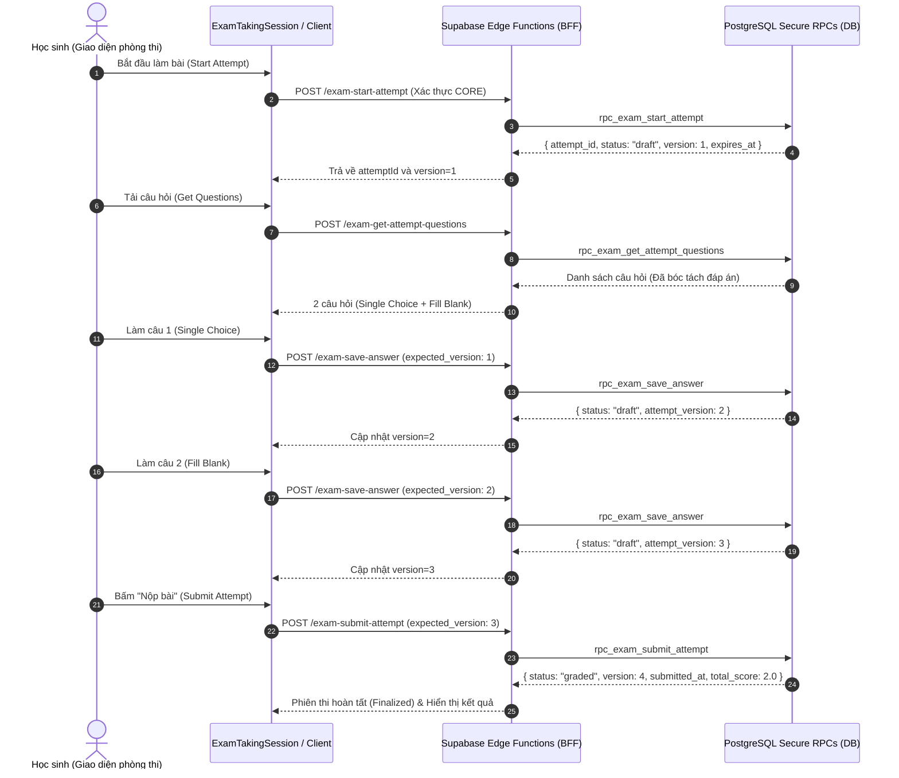

# Exam Builder V1 — Phase 3E: Student Exam Taking Lifecycle Acceptance & Verification

> **Trạng thái**: CLOSED ✅  
> **Phiên bản**: Phase 3E (Student Exam Taking, Autosave, Submit & Auto-Grading)  
> **Nhánh Git**: `feature/exam-builder-v1-clean`  
> **Trạng thái phát hành**: Feature branch only — Chưa merge vào `main` — Chưa deploy lên `Production`  

---

## 1. Tổng Quan & Phạm Vi (Scope)

Tài liệu này tổng hợp toàn bộ kết quả nghiệm thu kỹ thuật, kiến trúc bảo mật và kiểm định hồi quy cho **Phase 3E — Phân hệ Phòng thi và Nộp bài của Học sinh** trong hệ thống Exam Builder V1.

Phân hệ này cho phép học sinh:
- Xem danh sách bài thi được giao theo lớp học thực tế.
- Khởi động phiên làm bài thi an toàn với cơ chế khóa lạc quan (*optimistic locking*) và phân bổ mã phiên bởi máy chủ.
- Nhận danh sách câu hỏi an toàn (đã bóc tách 100% đáp án đúng và lời giải).
- Tự động lưu tiến độ làm bài cho cả câu trắc nghiệm (*single_choice*) và câu điền khuyết (*fill_blank*).
- Kiểm soát thời gian thi thực tế theo thời lượng cấu hình của bài thi (*fixed duration timer*).
- Nộp bài thi và tự động kích hoạt tiến trình chấm điểm máy chủ (*auto-grading*) theo chuẩn RPC nguyên tử.

---

## 2. Cấu Trúc Chính Thức Của Phase 3E (Phase 3E Structure)

Cấu trúc chính thức của Phase 3E bao gồm 3 phân đoạn phụ (*sub-phases*):

1. **Phase 3E-A (Frontend Foundation & Session Engine)**:
   - Xây dựng lớp dịch vụ điều khiển phiên làm bài thi `src/services/examTakingSession.js` và API client `src/services/examStudentClient.js`.
   - Quản lý máy trạng thái (*State Machine*), cơ chế khóa phiên bản `expected_version`, cô lập bộ nhớ và loại bỏ hoàn toàn việc lưu trữ token thủ công hoặc `localStorage`.
   - Kết quả kiểm thử: **108/108 PASS**.

2. **Phase 3E-B (Safe Delivery, BFF & UI Integration)**:
   - **Phase 3E-B0**: Hợp đồng RPC phân phối câu hỏi an toàn `rpc_exam_get_attempt_questions` (Migration `20260907000009` & `20260909000010`) và Edge Function BFF `exam-get-attempt-questions`.
   - **Phase 3E-B Step 2**: Modal phòng thi `src/components/dashboard/exams/ExamTakingModal.jsx` với vòng đời quản lý phiên thi, đếm ngược tham vấn (*advisory countdown*), dialog xác nhận nộp bài.
   - **Phase 3E-B Step 2.5**: Edge Function BFF `exam-list-student-assignments` đọc danh sách bài thi của học sinh theo lớp học CORE.
   - **Phase 3E-B Step 3**: Tích hợp tab học sinh `src/components/dashboard/exercise/ExerciseListTab.jsx` với quyền phân tách độc lập giữa bài tập SCORM/cũ và bài thi Exam Builder V1 mới.
   - Kết quả kiểm thử: **189/189 PASS**.

3. **Phase 3E-C (Hosted Taking, Autosave & Submit Smoke)**:
   - Thực thi chu trình làm bài E2E thực tế trên Version 3 sạch (*Clean Version 3*): Bắt đầu làm bài -> Lấy câu hỏi an toàn -> Tự động lưu Q1 -> Tự động lưu Q2 -> Nộp bài -> Chấm điểm tự động.
   - Kết quả: **PASS 100%**, toàn bộ chuyển đổi phiên bản và thời lượng thi được xác thực chính xác.

> [!NOTE]
> **Xác nhận cấu trúc**: Không tồn tại bất kỳ sub-phase nào khác (ví dụ: `Phase 3E-D` không tồn tại). Toàn bộ luồng học sinh làm bài thi hoàn tất tại Phase 3E-C.

---

## 3. Vòng Đời Thực Thi Môi Trường Chạy (Final Runtime Lifecycle)

Chu trình thực thi 7 bước chuẩn nguyên tử trong phiên thi:

---

## 4. Bất Biến Phiên Bản Phiên Thi (Attempt Version Invariant)

Mọi thao tác thay đổi trạng thái phiên thi đều chịu sự kiểm soát nghiêm ngặt của khóa lạc quan (*optimistic concurrency control*). Số phiên bản `version` tăng đơn điệu và chỉ được cấp phát bởi máy chủ:

| Giai đoạn | Hành động | Phiên bản trước | `expected_version` gửi lên | Phiên bản sau khi hoàn tất |
|---|---|:---:|:---:|:---:|
| 1 | `rpc_exam_start_attempt` | *Chưa có* | N/A | **1** |
| 2 | `rpc_exam_save_answer` (Q1: single_choice) | 1 | 1 | **2** |
| 3 | `rpc_exam_save_answer` (Q2: fill_blank) | 2 | 2 | **3** |
| 4 | `rpc_exam_submit_attempt` | 3 | 3 | **4** *(Trạng thái cuối: `graded`)* |

---

## 5. Bất Biến Thời Lượng & Hết Hạn (Expiry Invariant)

- **Cấu hình thời lượng bài thi**: `duration_minutes = 30` (30 phút).
- **Quy tắc tính toán**: `expires_at = attempt_started_at + INTERVAL '30 minutes'`.
- **Thời lượng thực tế đo lường**: `Math.round((expires_at - attempt_started_at) / 1000) === 1800` giây (Chính xác 100%).
- **Kiểm soát hết hạn**: Khi thời gian máy chủ vượt quá `expires_at`, các thao tác `save_answer` và `submit_attempt` đều bị từ chối an toàn với mã lỗi `ERR_ATTEMPT_EXPIRED` (HTTP 409).
- **Tính ổn định của Timer**: Máy chủ không bao giờ tự động gia hạn thời gian thi khi học sinh vào lại (*resume*) phiên thi `draft` đang mở.

---

## 6. Các Bất Biến Bảo Mật & Toàn Vẹn (Security Invariants)

1. **Không rò rỉ đáp án**: `0` trường `answer_key`, `correct_answer`, hay lời giải được gửi về trình duyệt học sinh qua endpoint `exam-get-attempt-questions`.
2. **Không ghi đè trực tiếp DB**: Mọi hành động khởi tạo, lưu câu trả lời, và nộp bài đều được thực hiện 100% qua RPC và Edge Functions chính thống.
3. **Bảo mật xác thực hai dự án**: Client học sinh xác thực danh tính người dùng qua cơ chế phiên của hệ thống; Edge Functions xác minh danh tính và quyền thành viên lớp học trên cơ sở dữ liệu CORE trước khi chuyển tiếp gọi RPC sang cơ sở dữ liệu NEW.
4. **Không lưu token trong LocalStorage**: Trình duyệt không lưu trữ token thủ công, không duy trì hàng đợi retry tùy tiện gây nghẽn phiên bản.

---

## 7. Kết Quả Kiểm Định Hồi Quy Toàn Diện (Regression Test Results)

Tất cả **12 bộ kiểm thử chính thức** trong thư mục `scripts/` (bao gồm 672 bài test tự động) đều đạt kết quả **100% PASS**:

| STT | Tên Bộ Kiểm Thử (Official Suite) | Số Bài Test | Trạng Thái |
|---|---|:---:|:---:|
| 1 | `scripts/test_exam_student_foundation.mjs` | 108 | **PASS** |
| 2 | `scripts/test_rpc_exam_get_attempt_questions.mjs` | 46 | **PASS** |
| 3 | `scripts/test_exam_get_attempt_questions_bff.mjs` | 71 | **PASS** |
| 4 | `scripts/test_exam_list_student_assignments_bff.mjs` | 37 | **PASS** |
| 5 | `scripts/test_exam_taking_modal_contract.mjs` | 37 | **PASS** |
| 6 | `scripts/test_exam_taking_parent_integration.mjs` | 38 | **PASS** |
| 7 | `scripts/test_exam_student_bff.mjs` | 149 | **PASS** |
| 8 | `scripts/test_use_exam_integrity_contract.mjs` | 19 | **PASS** |
| 9 | `scripts/test_exam_integrity_coordinator.mjs` | 15 | **PASS** |
| 10 | `scripts/test_exam_integrity_lifecycle.mjs` | 15 | **PASS** |
| 11 | `scripts/test_exam_integrity_queue.mjs` | 94 | **PASS** |
| 12 | `scripts/test_exam_integrity_session.mjs` | 43 | **PASS** |
| **Tổng** | **12 Bộ Kiểm Thử Tự Động** | **672** | **100% PASS (0 FAIL)** |

---

## 8. Bảo Toàn Dữ Liệu Lịch Sử (History Preservation)

- Dữ liệu thực nghiệm của **Version 1** và **Version 2** cùng toàn bộ các phiên làm bài trước đây đều được bảo toàn nguyên vẹn trong cơ sở dữ liệu, không bị xóa hay ghi đè.
- Quá trình chạy E2E nghiệm thu hoàn tất trên bản phát hành **Version 3 sạch** (*Clean Version 3*), phân giao chuẩn xác tới lớp học thực tế và ghi nhận điểm số tự động 2.0 / 2.0.

---

## 9. Ghi Chú Phân Tích Sự Cố Kỹ Thuật (Historical Root-Cause Note)

- Trong quá trình thử nghiệm khói ban đầu, một đoạn script thử nghiệm tạm thời đã trực tiếp thay đổi trường `expires_at` của một phiên thi V2 đã hết hạn để cố gắng tiếp tục thực thi.
- Hành vi này đã vi phạm hợp đồng bộ đếm thời gian cố định (*fixed-timer contract*).
- Đội ngũ kỹ thuật đã ngay lập tức **hủy bỏ giá trị chứng thực của phiên V2 đó**, cô lập đoạn script nguy hiểm vào lưu trữ, thiết lập lại phiên **Version 3 sạch**, và thực thi thành công toàn bộ chu trình E2E nộp bài trong khung giờ hợp lệ 30 phút mà không có bất kỳ can thiệp trực tiếp nào vào cơ sở dữ liệu.

---

## 10. Trạng Thái Nhánh & Phát Hành (Git & Release State)

- **Nhánh phát triển**: `feature/exam-builder-v1-clean`
- **Mã commit HEAD**: `12692b7bc7a17a726f8667a48240a0171cd8ad35`
- **Nhánh chính**: `main` chưa merge
- **Môi trường Production**: Chưa triển khai
- **Kết luận**: Đủ điều kiện tạo Pull Request và nghiệm thu chính thức Phase 3E.
