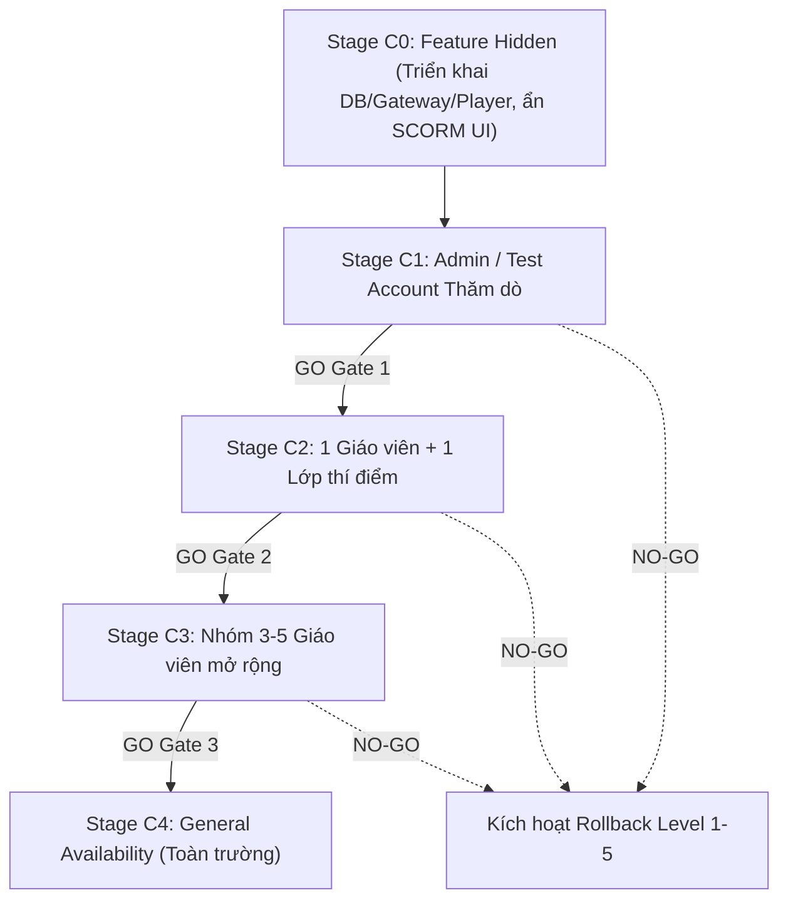
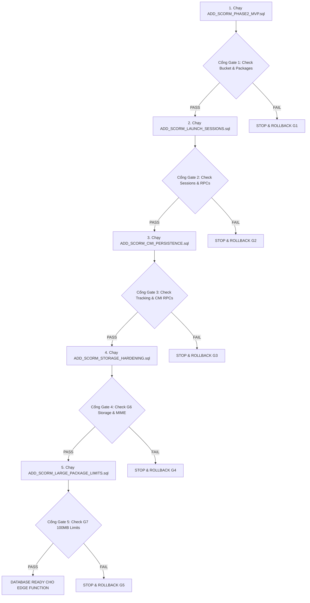
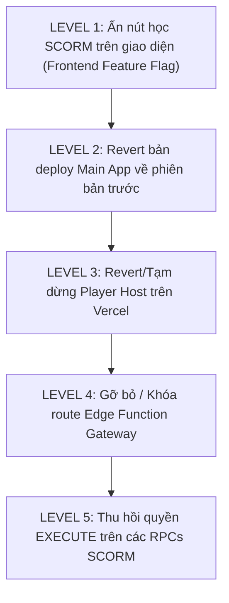

# 📘 SCORM PRODUCTION RELEASE RUNBOOK & CANARY DEPLOYMENT PLAN

> **Tài liệu quy trình chuẩn (SOP - Standard Operating Procedure) cho việc phát hành module SCORM lên môi trường Production.**
> **Trạng thái tài liệu:** KẾ HOẠCH PHÁT HÀNH (RELEASE PLAN - CHẾ ĐỘ READ-ONLY, KHÔNG TỰ ĐỘNG THỰC THI)
> **Phiên bản kế hoạch:** v2.0 (Đồng bộ với Staging Cloud Validation, 5-Stage Migration, G7 Large Package Limits & Save-Before-Close)

---

## 1. NGUYÊN TẮC PHÁT HÀNH & HIỆN TRẠNG (RELEASE PRINCIPLES & BASELINE)

```text
LOCAL_VALIDATION             = PASS (100% PGlite, Unit, Contract, Origin & Build Tests)
STAGING_RUNTIME_VALIDATION   = PASS (Xác thực thực tế trên Dedicated Supabase Staging)
EXACT_SOURCE_HEAD            = 8ea0c04e072fd567b8a17b5b7233e2d7b98b98f6 (integration/scorm-phase2)
PRODUCTION_PLANNING          = READY
PRODUCTION_READY             = AWAITING_EXPLICIT_USER_APPROVAL
```

### 🔴 Nguyên tắc an toàn cốt lõi:
1. **Kiểm soát phát hành từng bước (Controlled Phased Execution):** Quá trình đưa lên Production **bắt buộc** phải tuân theo thứ tự 15 bước (P0 – P15) và mô hình **Canary Rollout** (C0 – C4).
2. **Nguồn phát hành duy nhất (Single Source of Truth):** Toàn bộ bản phát hành phải lấy từ **chính xác commit HEAD đã kiểm thử toàn diện** trên nhánh `integration/scorm-phase2` (`8ea0c04e`). Tuyệt đối không tách nhỏ merge PR #26 rồi PR #27 để tránh làm mất 11 bản vá tích hợp quan trọng (Resume lifecycle, Save-Before-Close, CMI32 restore, G6 Storage sync, G7 100MB limits).
3. **Fail-Closed & Stop-on-Error:** Bất kỳ bước kiểm tra nào phát hiện lỗi (Gate Failure) đều lập tức dừng lại và thực hiện quy trình Rollback tương ứng.
4. **Bảo vệ dữ liệu người dùng (Non-Destructive Rollback):** Sau khi học sinh đã làm bài trên Production, tuyệt đối **KHÔNG DROP** bảng `scorm_tracking_data` hay phá hủy dữ liệu học tập thực tế trong mọi kịch bản sự cố.

---

## 2. KẾ HOẠCH PHÂN KỲ CANARY ROLLOUT (STAGES C0 – C4)

Do đã có môi trường Staging Cloud độc lập xác thực runtime, Canary trên Production chỉ đóng vai trò xác thực tính tương thích của môi trường Production thực tế:



| Giai đoạn | Đối tượng áp dụng | Mục tiêu kiểm chứng | Điều kiện GO / NO-GO |
| :--- | :--- | :--- | :--- |
| **Stage C0** | *Toàn bộ người dùng* | Triển khai DB, Gateway và Player nhưng ẩn UI SCORM | Database 5 gates PASS, Gateway và Player Host online an toàn. |
| **Stage C1** | *1 Tài khoản Admin / Tester nội bộ* | Tải lên 1 gói SCORM mẫu nhỏ (< 2MB), chạy đủ flow nạp/lưu CMI | Không phát sinh lỗi console, CMI lưu chuẩn, Edge Function 200. |
| **Stage C2** | *1 Giáo viên + 1 Lớp học nhỏ* | Giáo viên tải bài giảng thật, học sinh học và hoàn thành | Tiến độ lưu chính xác, không xung đột concurrent, resume tốt. |
| **Stage C3** | *Nhóm 3–5 Giáo viên* | Kiểm tra đa dạng gói SCORM (Storyline, iSpring, Captivate, dung lượng tới 100MB) | Dung lượng package đa dạng, tải mượt mà, không nghẽn Gateway. |
| **Stage C4** | *Toàn bộ Nhà trường (GA)* | Mở rộng tính năng cho toàn bộ giáo viên và học sinh | Hệ thống ổn định trong 72h, tỷ lệ lỗi < 0.01%. |

---

## 3. CHECKLIST SAO LƯU & AN TOÀN TRƯỚC PHÁT HÀNH (PRE-RELEASE BACKUP)

```text
TARGET_PRODUCTION_PROJECT_REF = nddimmxpymipalpxlops
BACKUP_READINESS_CHECKLIST    = REQUIRED BEFORE ANY MUTATION
```

Trước khi thực hiện bất kỳ thao tác nào trên Production:
- [ ] **Database Snapshot:** Tạo bản sao lưu toàn bộ cơ sở dữ liệu Supabase Production (`nddimmxpymipalpxlops`) qua Supabase Dashboard -> Database -> Backups.
- [ ] **Ghi nhận Git HEAD hiện tại:** Lưu trữ mã SHA của nhánh `main` trước khi merge (`PRE_RELEASE_MAIN_SHA`).
- [ ] **Ghi nhận Vercel Production Deployment:** Lưu ID và URL của bản build Production hiện tại của Main App (`PRE_RELEASE_VERCEL_ID`).
- [ ] **Ghi nhận Edge Function State:** Kiểm tra danh sách functions hiện tại trên Supabase (`supabase functions list --project-ref nddimmxpymipalpxlops`).
- [ ] **Kiểm tra Object Inventory:** Chụp ảnh bảng, triggers, RPCs hiện có để sẵn sàng đối chiếu.

---

## 4. CHIẾN LƯỢC NGUỒN PHÁT HÀNH GIT (RELEASE GIT STRATEGY)

Nhánh `integration/scorm-phase2` tại commit `8ea0c04e` đã tích hợp đầy đủ và xác thực 100%:
* Toàn bộ mã nguồn của PR #26 (`feature/scorm-phase2-mvp`)
* Toàn bộ mã nguồn của PR #27 (`feature/scorm-cmi-persistence`)
* 11 bản vá bảo mật và hoàn thiện tích hợp:
  1. `2c9eef1`: Củng cố cấu hình Player Origin fail-safe trên Preview/Production.
  2. `dd16b5c`: Tách độc lập build SCORM Player tự cung tự cấp.
  3. `68eb1fc`: Chuẩn hóa MIME Type cho HTML iframe.
  4. `ee20add`: Hợp đồng share token cho tài liệu công khai.
  5. `ab6acab` & `0154d78`: Chuẩn hóa MIME ZIP Blob trên trình duyệt Windows/Chrome.
  6. `5547a68`: Khử sandbox CSP upstream trên Gateway.
  7. `ddf4549`: Đồng bộ migration củng cố storage RLS G6.
  8. `dc89fe6`: Nâng hạn mức gói học liệu lớn G7 (100MB).
  9. `d49ffa9`: Tái tạo vòng đời Resume và reset exit/session_time.
  10. `a4682f1`: Tính năng Lưu tiến độ trước khi đóng modal (*Save-Before-Close*) và khôi phục `CMI32`.
  11. `8ea0c04`: Đồng bộ hằng số kiểm thử di sản với G7 limits.

### 🔴 Quy tắc Git Release:
* **KHÔNG** merge lần lượt PR #26 và PR #27 vào `main` (sẽ gây thiếu 11 bản vá trên hoặc xung đột rebase).
* **ĐỀ XUẤT DUY NHẤT:** Tạo 1 Release PR duy nhất từ `integration/scorm-phase2` (HEAD `8ea0c04e`) vào `main` (hoặc merge trực tiếp nhánh đã xác thực vào `main`) sau khi hoàn tất các cổng DB, Gateway và Player readiness.
* **Lưu ý:** Việc push vào `main` sẽ kích hoạt Vercel tự động build & deploy Production Main App. Do đó, bước merge/push `main` phải đặt ở **giai đoạn P12** (sau khi hạ tầng DB, Gateway và Player đã sẵn sàng).

---

## 5. THỨ TỰ THỰC THI 5 GIAI ĐOẠN MIGRATION DATABASE & CỔNG KIỂM TRA (DB GATES)

Tuyệt đối **không chạy gộp** 5 file migration. Sau **mỗi** file, phải thực hiện kiểm tra tại Cổng tương ứng:



### 🔹 Stage M1: `ADD_SCORM_PHASE2_MVP.sql`
* **Mục đích:** Tạo bảng `scorm_packages`, enum `scorm` trong `learning_materials.file_type`, khởi tạo bucket `scorm-content` (private).
* **Cổng Gate 1 (Chạy `POST_SCORM_PHASE2_APPLY_VERIFY.sql`):**
  - [ ] Bảng `public.scorm_packages` tồn tại và bật RLS.
  - [ ] Bucket `scorm-content` tồn tại với thuộc tính `public = false`.
  - [ ] Ràng buộc `learning_materials.file_type` chấp nhận `'scorm'`.
  - [ ] Trigger `sync_scorm_package_owner` hoạt động, chặn đổi owner trái phép.

### 🔹 Stage M2: `ADD_SCORM_LAUNCH_SESSIONS.sql`
* **Mục đích:** Kích hoạt `pgcrypto` trong schema `extensions`, tạo bảng `scorm_launch_sessions`, hàm sinh 256-bit CSPRNG token và Trusted Resolver `resolve_scorm_session_asset`.
* **Cổng Gate 2 (Chạy `POST_SCORM_LAUNCH_SESSIONS_APPLY_VERIFY.sql`):**
  - [ ] Bảng `public.scorm_launch_sessions` tồn tại với RLS khóa toàn bộ direct access từ browser.
  - [ ] RPCs `create_scorm_launch_session_authenticated`, `create_public_scorm_launch_session`, `resolve_scorm_session_asset` đã tạo.
  - [ ] Phân quyền RPC: `resolve_scorm_session_asset` bị thu hồi khỏi `PUBLIC/anon/authenticated`, chỉ cấp cho `service_role`.
  - [ ] Băm SHA-256 đối chiếu server-side hoạt động chuẩn.

### 🔹 Stage M3: `ADD_SCORM_CMI_PERSISTENCE.sql`
* **Mục đích:** Tạo bảng `scorm_tracking_data` (RPC-Only), các hàm tính toán thời gian, RPCs `load_scorm_cmi_state` và `save_scorm_cmi_state`.
* **Cổng Gate 3 (Chạy `POST_SCORM_CMI_PERSISTENCE_APPLY_VERIFY.sql`):**
  - [ ] Bảng `public.scorm_tracking_data` tồn tại, khóa hoàn toàn direct client access (RPC-Only).
  - [ ] RPCs `load_scorm_cmi_state` và `save_scorm_cmi_state` có `SECURITY DEFINER` và `SET search_path = ''`.
  - [ ] Phân quyền execute: Thu hồi khỏi `PUBLIC/anon`, chỉ cấp cho `authenticated`.
  - [ ] Hàm `resolve_scorm_session_asset` trả về `tracking: null` cho session public.

### 🔹 Stage M4: `ADD_SCORM_STORAGE_HARDENING.sql`
* **Mục đích:** Thêm `application/zip` vào `learning-materials` allowed MIME types, cập nhật RLS Storage cho phép giáo viên upload/delete trong `scorm-zips/<uid>/...`.
* **Cổng Gate 4:**
  - [ ] Bucket `learning-materials` chứa MIME `application/zip`.
  - [ ] Policy `learning_materials_storage_insert` cho phép giáo viên tải lên `scorm-zips/<auth.uid()>/...`.
  - [ ] Policy `learning_materials_storage_delete` cho phép giáo viên xóa file trong `scorm-zips/<auth.uid()>/...`.

### 🔹 Stage M5: `ADD_SCORM_LARGE_PACKAGE_LIMITS.sql`
* **Mục đích:** Nâng `file_size_limit` lên 100MB (104,857,600 bytes) cho cả 2 bucket `learning-materials` và `scorm-content`.
* **Cổng Gate 5:**
  - [ ] `SELECT id, file_size_limit, public FROM storage.buckets WHERE id IN ('learning-materials', 'scorm-content');`
  - [ ] Cả 2 buckets đều có `file_size_limit = 104857600` và `public = false`.

---

## 6. QUY TRÌNH TRIỂN KHAI EDGE FUNCTION (`scorm-asset-gateway`)

### Điều kiện tiên quyết (Preconditions):
- [ ] Toàn bộ Database Gate 1 đến 5 đã PASS 100%.
- [ ] File cấu hình `supabase/config.toml` đặt `verify_jwt = false` **chỉ riêng** cho `scorm-asset-gateway`.

### Lệnh triển khai (Kế hoạch):
```bash
npx.cmd supabase functions deploy scorm-asset-gateway --project-ref nddimmxpymipalpxlops --no-verify-jwt --use-api
```

### Smoke Test Gateway sau khi deploy:
1. Gửi request `GET /` không có token -> Nhận `HTTP 403 Forbidden`.
2. Gửi request với token giả -> Nhận `HTTP 403 Forbidden`.
3. Gửi request path traversal `GET /session/fake/..%2f..%2fconfig` -> Nhận `HTTP 403 Forbidden`.
4. Gửi request `OPTIONS` / `HEAD` -> Header trả về `Referrer-Policy: no-referrer`, `X-Content-Type-Options: nosniff`.

---

## 7. QUY TRÌNH TRIỂN KHAI PLAYER HOST ĐỘC LẬP (`scorm-player`)

### Yêu cầu kiến trúc:
* **Không sử dụng URL Preview Player cho Production.**
* Thiết lập một Vercel Project hoặc subdomain riêng biệt cho Production Player:
  * Domain dự kiến: `https://player.<domain>.com` hoặc Vercel Production alias (`PRODUCTION_PLAYER_DOMAIN = MANUAL_CONFIRMATION_REQUIRED`).

### Cấu hình biến môi trường trên Vercel của SCORM Player:
```text
SCORM_GATEWAY_UPSTREAM = https://nddimmxpymipalpxlops.supabase.co/functions/v1/scorm-asset-gateway
```
*(Tuyệt đối không dùng tiền tố `VITE_` để không bị lộ URL upstream vào frontend bundle).*

### Kiểm tra xác thực Origin & Security:
- [ ] `PLAYER_ORIGIN_REAL` khác hoàn toàn `MAIN_ORIGIN_REAL` để đảm bảo Origin Isolation.
- [ ] Endpoint `/session-info` và `/session/*` trả về đúng Reverse Proxy headers.
- [ ] Không có header `Location` chuyển hướng (302) sang Supabase Storage.
- [ ] Security headers `X-Content-Type-Options: nosniff` và `Referrer-Policy: no-referrer` hiện diện.

---

## 8. CẤU HÌNH BIẾN MÔI TRƯỜNG MAIN APPLICATION

Cập nhật biến môi trường trên Production Hosting của Main App:
```text
VITE_SUPABASE_URL        = https://nddimmxpymipalpxlops.supabase.co
VITE_SUPABASE_ANON_KEY   = <Production Supabase Anon Key>
VITE_SCORM_PLAYER_ORIGIN = <Production Player Domain>
```

### Kiểm tra an toàn:
- [ ] `MaterialViewerModal.jsx` đọc đúng `playerOrigin` từ biến môi trường.
- [ ] Cầu nối postMessage thực hiện xác thực Exact Origin (`if (event.origin !== playerOrigin) return;`).
- [ ] Tuyệt đối không dùng ký tự đại diện `'*'` trong `targetOrigin` của `postMessage`.

---

## 9. KỊCH BẢN THỬ NGHIỆM THỰC TẾ TRÊN PRODUCTION (SMOKE TEST SCENARIOS)

### Kịch bản 1: Bài giảng SCORM 1.2 Mẫu
1. Giáo viên (tài khoản Test) tải lên gói SCORM 1.2 dung lượng nhỏ (< 2MB).
2. Hệ thống giải nén, manifest parser trích xuất đúng `launch_path`.
3. Học sinh nhấn *"Bắt đầu học"*:
   - Modal mở iframe trỏ sang Player Host Origin B.
   - SCO nạp tài nguyên CSS, JS, Image thành công (HTTP 200/206).
   - SCO gọi `LMSInitialize("")` -> Trả về `"true"`.
   - Học sinh chuyển slide -> SCO gọi `LMSSetValue("cmi.core.lesson_location", "slide_2")` & `LMSCommit("")`.
   - Main App nhận postMessage `SCORM_CMI_COMMIT`, gọi RPC lưu DB và gửi ACK `SCORM_CMI_SAVED`.
   - SCO gọi `LMSFinish("")` -> Lưu trạng thái hoàn thành.
4. Đóng bài học và mở lại -> Vị trí học được tự động tiếp tục tại `slide_2` (Resume thành công).

### Kịch bản 2: Bài giảng SCORM 2004 Mẫu
1. Tải lên gói SCORM 2004 4th Edition.
2. Học sinh khởi chạy bài học -> `API_1484_11.Initialize("")` thành công.
3. Học sinh làm bài đạt 80 điểm -> `cmi.score.raw = 80`, `cmi.completion_status = completed`.
4. Gọi `Terminate("")` -> Tiến độ được lưu vĩnh viễn vào DB.

### Kịch bản 3: Tính năng Save-Before-Close
1. Học sinh đang làm bài, chưa bấm nút Nộp bài / Kết thúc trong SCORM nhưng bấm nút đóng modal [X] ở góc ngoài.
2. Main App gửi `SCORM_REQUEST_SAVE_BEFORE_CLOSE` tới Player.
3. Player gọi `_getCmi()` trích xuất snapshot mới nhất và gửi `PARENT_CLOSE_SNAPSHOT` về Main.
4. Main App gọi RPC `save_scorm_cmi_state` thành công rồi mới đóng modal an toàn.

---

## 10. KIỂM THỬ AN TOÀN PHÒNG VỆ (NEGATIVE SECURITY SMOKE TESTS)

Thực hiện các ca kiểm thử bảo mật không phá hủy (Non-Destructive):
- [ ] **Fake Token:** Gửi yêu cầu với session token giả -> Gateway chặn 403.
- [ ] **Expired Token:** Sử dụng session token quá hạn 10 phút -> Gateway chặn 403, RPC chặn `SESSION_EXPIRED`.
- [ ] **Token Theft Simulation:** Dùng token của User A gọi RPC dưới danh tính User B -> RPC chặn `SESSION_USER_MISMATCH`.
- [ ] **Path Traversal Attack:** Gửi URL `/session/<token>/../../etc/passwd` -> Bị chặn 403.
- [ ] **Direct Anon RPC:** Gọi `save_scorm_cmi_state` dưới vai trò ẩn danh -> Supabase trả `401 Unauthorized / Permission Denied`.
- [ ] **Direct Storage Access:** Truy cập trực tiếp link tệp trong bucket `scorm-content` -> Trả về `AccessDenied` (Private Bucket).

---

## 11. GIỚI HẠN DUNG LƯỢNG G7 & HTTP RANGE STREAMING

```text
MAX_ZIP_SIZE                = 100MB (104,857,600 bytes)
MAX_SINGLE_FILE_SIZE        = 100MB (104,857,600 bytes)
MAX_TOTAL_UNCOMPRESSED_SIZE = 300MB (314,572,800 bytes)
MAX_ENTRY_COUNT             = 1000 entries
MAX_PATH_DEPTH              = 10 levels
MAX_COMPRESSION_RATIO       = 100x
RANGE_MODE                  = FULL_DOWNLOAD_SLICE (RFC 7233 Range Requests 206 Partial Content)
```

---

## 12. CHIẾN LƯỢC ROLLBACK ĐA TẦNG (LEVEL 1 – 5)

Khi gặp sự cố nghiêm trọng trên Production, kích hoạt tầng Rollback tương ứng từ nhẹ đến sâu:



### ⚠️ Quy định bảo vệ dữ liệu DB:
- **KHÔNG DROP bảng `scorm_tracking_data`:** Tuyệt đối không xóa bảng hay trigger sau khi người dùng đã học.
- **Rollback Destructive (Chỉ khi chưa có dữ liệu thật):** Chỉ được thực hiện khi có sự phê duyệt trực tiếp của release manager và sau khi đã backup DB an toàn tại bước P0.

---

## 13. MA TRẬN 16 CHECKPOINTS PHÁT HÀNH (RELEASE CHECKPOINTS P0 – P15)

| Checkpoint | Hạng mục | Tiêu chí Hoàn thành | Quyết định | Kịch bản Rollback |
| :--- | :--- | :--- | :---: | :--- |
| **P0** | Backup Readiness | Database snapshot hoàn tất, Git SHA ghi nhận | **GO / NO-GO** | Dừng phát hành nếu chưa backup |
| **P1** | Prod DB Preflight | Chạy các câu lệnh SELECT kiểm tra trạng thái DB | **GO / NO-GO** | Dừng nếu xung đột schema |
| **P2** | Migration M1 | Chạy `ADD_SCORM_PHASE2_MVP.sql` -> Gate 1 PASS | **GO / NO-GO** | `ROLLBACK;` |
| **P3** | Migration M2 | Chạy `ADD_SCORM_LAUNCH_SESSIONS.sql` -> Gate 2 PASS | **GO / NO-GO** | Khôi phục snapshot P0 |
| **P4** | Migration M3 | Chạy `ADD_SCORM_CMI_PERSISTENCE.sql` -> Gate 3 PASS | **GO / NO-GO** | Khôi phục snapshot P0 |
| **P5** | Migration M4 | Chạy `ADD_SCORM_STORAGE_HARDENING.sql` -> Gate 4 PASS | **GO / NO-GO** | Khôi phục snapshot P0 |
| **P6** | Migration M5 | Chạy `ADD_SCORM_LARGE_PACKAGE_LIMITS.sql` -> Gate 5 PASS | **GO / NO-GO** | Khôi phục snapshot P0 |
| **P7** | Edge Deploy | Deploy `scorm-asset-gateway` lên project `nddimmxpymipalpxlops` | **GO / NO-GO** | Un-deploy / Revert function |
| **P8** | Gateway Smoke | Negative test 403 (No token, Fake token, Traversal) PASS | **GO / NO-GO** | Revert Edge Function |
| **P9** | Player Deploy | Triển khai `scorm-player` lên domain độc lập | **GO / NO-GO** | Tạm dừng deployment |
| **P10**| Player Smoke | Origin isolation & Reverse proxy asset smoke PASS | **GO / NO-GO** | Kiểm tra env upstream |
| **P11**| Main App Config | Cập nhật `VITE_SCORM_PLAYER_ORIGIN` trên Production | **GO / NO-GO** | Revert config Vercel |
| **P12**| Release Git HEAD | Merge exact validated HEAD `8ea0c04e` vào `main` | **GO / NO-GO** | Revert commit trên `main` |
| **P13**| Admin Canary (C1)| Tài khoản Tester chạy mượt mà gói SCORM 1.2 & 2004 | **GO / NO-GO** | Kích hoạt Rollback Level 1 |
| **P14**| Pilot Class (C2) | 1 Giáo viên + 1 Lớp học thử nghiệm thành công 24h | **GO / NO-GO** | Giới hạn tài khoản giáo viên |
| **P15**| Wider Rollout (C4)| Mở rộng tính năng toàn trường an toàn (GA) | **DONE** | Giám sát 72h |

---

*Tài liệu này được cập nhật bởi Antigravity DevOps & Release Management Team nhằm đảm bảo an toàn tuyệt đối cho hệ thống dữ liệu học tập.*
