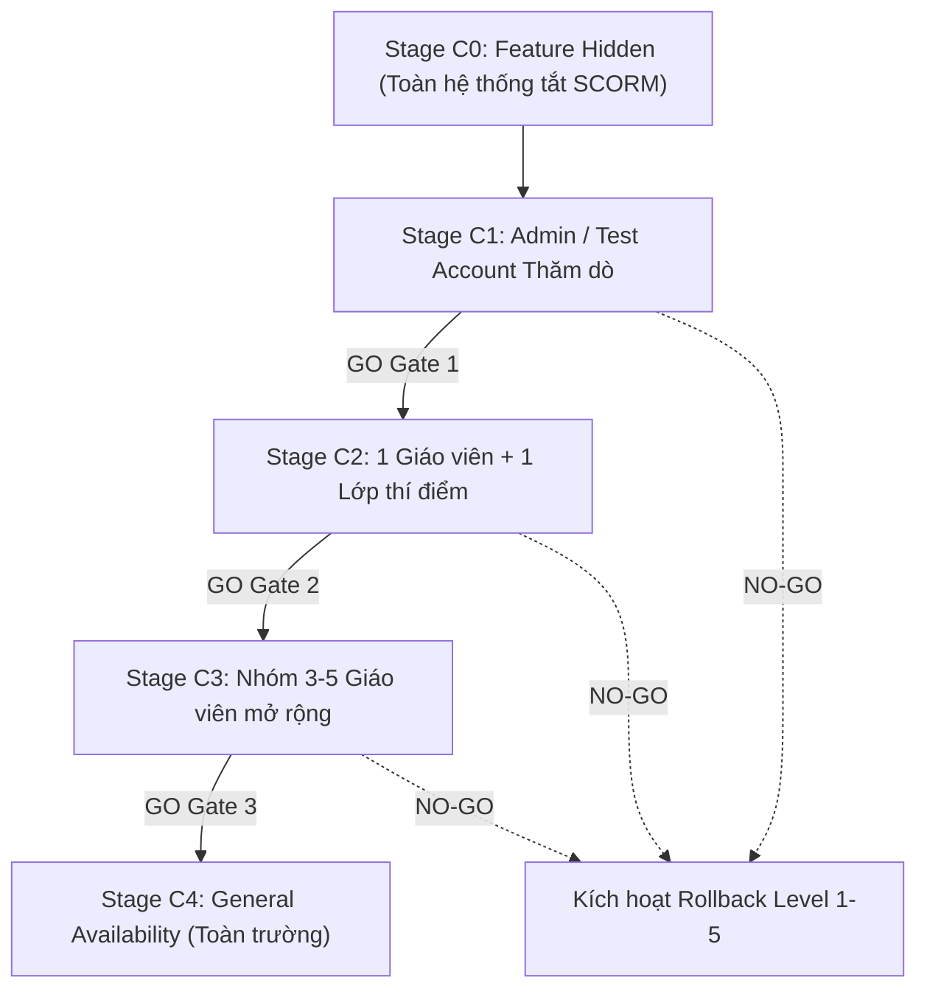
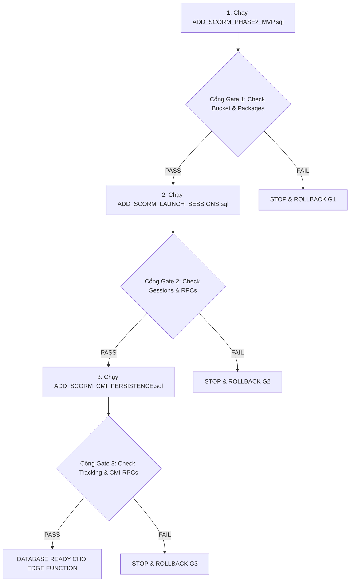
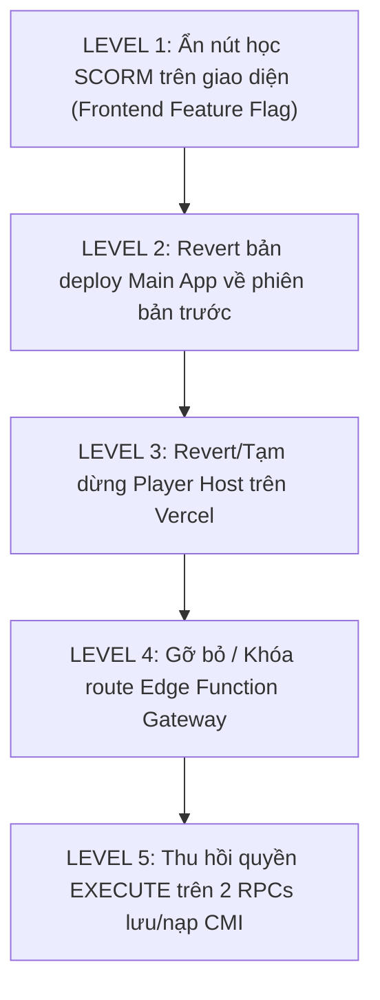

# 📘 SCORM PRODUCTION RELEASE RUNBOOK & CANARY DEPLOYMENT PLAN

> **Tài liệu quy trình chuẩn (SOP - Standard Operating Procedure) cho việc phát hành module SCORM lên môi trường Production.**
> **Trạng thái tài liệu:** KẾ HOẠCH PHÁT HÀNH (RELEASE PLAN - KHÔNG THỰC THI TỰ ĐỘNG)

---

## 1. NGUYÊN TẮC PHÁT HÀNH & HIỆN TRẠNG (RELEASE PRINCIPLES)

```text
LOCAL_VALIDATION         = PASS (100% PGlite, Unit, Integration & Build Tests)
PRODUCTION_PLANNING      = READY
CLOUD_RUNTIME_VERIFIED   = NO
PRODUCTION_READY         = NO
```

### 🔴 Nguyên tắc cốt lõi:
1. **Không triển khai diện rộng ngay lập tức:** Do hệ thống không có môi trường Staging Cloud độc lập, quá trình đưa lên Production **bắt buộc** phải tuân theo mô hình **Controlled Canary Rollout** (triển khai thăm dò từng bước có kiểm soát).
2. **Fail-Closed & Stop-on-Error:** Bất kỳ bước kiểm tra nào phát hiện lỗi (Gate Failure) đều kích hoạt dừng khẩn cấp và thực hiện quy trình Rollback tương ứng.
3. **Bảo vệ dữ liệu người dùng (Non-Destructive Rollback):** Tuyệt đối không xóa bảng `scorm_tracking_data` hoặc phá hủy dữ liệu học tập thực tế trong kịch bản rollback sau khi học sinh đã sử dụng.

---

## 2. KẾ HOẠCH PHÂN KỲ CANARY ROLLOUT (STAGES C0 – C4)



| Giai đoạn | Đối tượng áp dụng | Mục tiêu kiểm chứng | Điều kiện GO / NO-GO |
| :--- | :--- | :--- | :--- |
| **Stage C0** | *Toàn bộ người dùng* | Triển khai mã nguồn và DB nhưng ẩn UI SCORM | Database, Gateway và Player Host online an toàn. |
| **Stage C1** | *1 Tài khoản Admin / Tester nội bộ* | Tải lên 1 gói SCORM mẫu nhỏ (< 2MB), chạy đủ flow nạp/lưu CMI | Không phát sinh lỗi console, CMI lưu chuẩn, Edge Function 200. |
| **Stage C2** | *1 Giáo viên + 1 Lớp học nhỏ* | Giáo viên tải bài giảng thật, học sinh học và hoàn thành | Tiến độ lưu chính xác, không xung đột concurrent, resume tốt. |
| **Stage C3** | *Nhóm 3–5 Giáo viên* | Kiểm tra đa dạng gói SCORM (Articulate Storyline, iSpring, Adobe Captivate) | Dung lượng package đa dạng, tải mượt mà, không nghẽn Gateway. |
| **Stage C4** | *Toàn bộ Nhà trường (GA)* | Mở rộng tính năng cho toàn bộ giáo viên và học sinh | Hệ thống ổn định trong 72h, tỷ lệ lỗi < 0.01%. |

---

## 3. CHECKLIST SAO LƯU & AN TOÀN TRƯỚC PHÁT HÀNH (PRE-RELEASE BACKUP)

```text
BACKUP_READINESS_CHECKLIST = DEFINED
```

Trước khi thực hiện bất kỳ thao tác nào trên Production:
- [ ] **Database Snapshot:** Tạo bản sao lưu toàn bộ cơ sở dữ liệu Supabase Production (Manual Database Backup / Export).
- [ ] **Ghi nhận Git HEAD hiện tại:** Lưu trữ mã SHA của nhánh `main` trước khi merge (`PRE_RELEASE_MAIN_SHA`).
- [ ] **Ghi nhận Vercel Production Deployment:** Lưu ID và URL của bản build Production hiện tại của Main App (`PRE_RELEASE_VERCEL_ID`).
- [ ] **Ghi nhận Edge Function State:** Kiểm tra danh sách functions hiện tại trên Supabase (`supabase functions list`).
- [ ] **Kiểm tra Object Inventory:** Chụp ảnh bảng, triggers, RPCs hiện có để sẵn sàng đối chiếu.

---

## 4. QUY TRÌNH THỨ TỰ MERGE GIT (MERGE ORDER)

Tuyệt đối tuân thủ thứ tự tuần tự để bảo vệ lịch sử git và độ toàn vẹn của PR Stack:

1. **Review và Merge PR #26 (`feature/scorm-phase2-mvp`) vào `main`.**
2. Cập nhật `main` local:
   ```bash
   git fetch origin
   git switch main
   git pull origin main
   ```
3. Cập nhật nhánh PR #27 và đổi Base PR #27 sang `main`:
   ```bash
   git switch feature/scorm-cmi-persistence
   git merge origin/main
   git push origin feature/scorm-cmi-persistence
   ```
4. Trên GitHub PR #27: Đổi Base branch từ `feature/scorm-phase2-mvp` sang `main`.
5. Xác minh diff trên PR #27 chỉ còn đúng **8 files** của Phase 2B-2.
6. Chạy lại kiểm thử hồi quy toàn diện:
   ```bash
   node scripts/test_scorm_cmi_persistence.js
   node scripts/test_scorm_player_host.js
   node scripts/test_scorm_asset_gateway.js
   npm run test:pglite
   npm run build
   ```
7. **Review và Merge PR #27 (`feature/scorm-cmi-persistence`) vào `main`.**

---

## 5. THỨ TỰ THỰC THI MIGRATION DATABASE & CỔNG KIỂM TRA (DB GATES)

Tuyệt đối không chạy 3 file migration liên tiếp. Sau **mỗi** file, phải thực hiện kiểm tra tại Cổng tương ứng:



### 🔹 Gate 1 (Sau khi chạy `ADD_SCORM_PHASE2_MVP.sql`):
- [ ] Bảng `public.scorm_packages` tồn tại và bật RLS.
- [ ] Bucket `scorm-content` tồn tại với thuộc tính `public = false`.
- [ ] Ràng buộc `learning_materials.file_type` chấp nhận `'scorm'`.
- [ ] Trigger `sync_scorm_package_owner` hoạt động, chặn đổi owner trái phép.

### 🔹 Gate 2 (Sau khi chạy `ADD_SCORM_LAUNCH_SESSIONS.sql`):
- [ ] Bảng `public.scorm_launch_sessions` tồn tại với RLS khóa toàn bộ direct access.
- [ ] RPCs `create_scorm_launch_session_authenticated`, `create_public_scorm_launch_session`, `resolve_scorm_session_asset` đã tạo.
- [ ] Phân quyền RPC: `resolve_scorm_session_asset` bị thu hồi khỏi `PUBLIC/anon/authenticated`, chỉ cho `service_role`.
- [ ] Cơ chế băm SHA-256 đối chiếu server-side hoạt động.

### 🔹 Gate 3 (Sau khi chạy `ADD_SCORM_CMI_PERSISTENCE.sql`):
- [ ] Bảng `public.scorm_tracking_data` tồn tại, khóa hoàn toàn direct client access (RPC-Only).
- [ ] RPCs `load_scorm_cmi_state` và `save_scorm_cmi_state` có `SECURITY DEFINER` và `SET search_path = ''`.
- [ ] Phân quyền execute: Thu hồi khỏi `PUBLIC/anon`, chỉ cấp cho `authenticated`.
- [ ] Hàm `resolve_scorm_session_asset` trả về `tracking: null` cho session public.

---

## 6. QUY TRÌNH TRIỂN KHAI EDGE FUNCTION (`scorm-asset-gateway`)

### Điều kiện tiên quyết (Preconditions):
- [ ] Database Gate 1, 2, 3 đã PASS 100%.
- [ ] Service Role Key được cấu hình an toàn server-side trên Supabase Dashboard.
- [ ] File cấu hình `supabase/config.toml` đặt `verify_jwt = false` **chỉ riêng** cho `scorm-asset-gateway`.

### Lệnh triển khai:
```bash
npx supabase functions deploy scorm-asset-gateway --no-verify-jwt
```

### Smoke Test Gateway sau khi deploy:
1. Gửi request `GET /` không có token -> Nhận `HTTP 403 Forbidden`.
2. Gửi request với fake token -> Nhận `HTTP 403 Forbidden`.
3. Gửi request path traversal `GET /session/fake/..%2f..%2fconfig` -> Nhận `HTTP 403 Forbidden`.
4. Gửi request `OPTIONS` / `HEAD` -> Header trả về `Referrer-Policy: no-referrer`, `X-Content-Type-Options: nosniff`.

---

## 7. QUY TRÌNH TRIỂN KHAI PLAYER HOST ĐỘC LẬP (`scorm-player`)

### Cấu hình biến môi trường trên Vercel:
```text
SCORM_GATEWAY_UPSTREAM = https://<project-ref>.supabase.co/functions/v1/scorm-asset-gateway
```
*(Tuyệt đối không dùng tiền tố `VITE_` để không bị lộ URL upstream vào frontend bundle).*

### Lệnh triển khai:
```bash
cd scorm-player
vercel --prod
```

### Kiểm tra xác thực Origin & Security:
```text
PLAYER_ORIGIN_REAL = https://scorm.<domain>.com (hoặc https://scorm-player-xxx.vercel.app)
MAIN_ORIGIN_REAL   = https://app.<domain>.com
(Xác nhận PLAYER_ORIGIN_REAL != MAIN_ORIGIN_REAL để bảo đảm Origin Isolation)
```
- [ ] Endpoint `/session-info` và `/session/*` trả về đúng Reverse Proxy headers.
- [ ] Không có header `Location` chuyển hướng (302) sang Supabase Storage.
- [ ] Security headers `X-Content-Type-Options: nosniff` và `Referrer-Policy: no-referrer` hiện diện.

---

## 8. CẤU HÌNH MAIN APPLICATION

Cập nhật biến môi trường trên Production Hosting của Main App:
```text
VITE_SCORM_PLAYER_ORIGIN = https://scorm.<domain>.com
```

### Kiểm tra an toàn:
- [ ] `MaterialViewerModal.jsx` đọc đúng `playerOrigin` từ biến môi trường.
- [ ] Cầu nối postMessage thực hiện xác thực `if (event.origin !== playerOrigin) return;`.
- [ ] Tuyệt đối không dùng ký tự đại diện `'*'` trong `targetOrigin` của `postMessage`.

---

## 9. KỊCH BẢN THỬ NGHIỆM THỰC TẾ TRÊN PRODUCTION (SMOKE TEST SCENARIOS)

### Kịch bản 1: Bài giảng SCORM 1.2 Mẫu
1. Giáo viên (tài khoản Test) tải lên gói SCORM 1.2 dung lượng nhỏ (< 2MB).
2. Hệ thống unzip, manifest parser trích xuất đúng `launch_path`.
3. Học sinh nhấn *"Bắt đầu học"*:
   - Modal mở iframe trỏ sang Player Host Origin B.
   - SCO nạp tài nguyên CSS, JS, Image thành công (HTTP 200/206).
   - SCO gọi `LMSInitialize("")` -> Trả về `"true"`.
   - Học sinh chuyển trang -> SCO gọi `LMSSetValue("cmi.core.lesson_location", "slide_2")` & `LMSCommit("")`.
   - Main App nhận postMessage `SCORM_CMI_COMMIT`, gọi RPC lưu DB và gửi ACK `SCORM_CMI_SAVED`.
   - SCO gọi `LMSFinish("")` -> Lưu trạng thái hoàn thành.
4. Đóng bài học và mở lại -> Vị trí học được tự động tiếp tục tại `slide_2` (Resume thành công).

### Kịch bản 2: Bài giảng SCORM 2004 Mẫu
1. Tải lên gói SCORM 2004 4th Edition.
2. Học sinh khởi chạy bài học -> `API_1484_11.Initialize("")` thành công.
3. Học sinh làm bài đạt 80 điểm -> `cmi.score.raw = 80`, `cmi.completion_status = completed`.
4. Gọi `Terminate("")` -> Tiến độ được lưu vĩnh viễn vào DB.

---

## 10. KIỂM THỬ AN TOÀN PHÒNG VỆ (NEGATIVE SECURITY SMOKE TESTS)

Thực hiện các ca kiểm thử bảo mật không phá hủy (Non-Destructive):
- [ ] **Fake Token:** Gửi yêu cầu với session token giả -> Gateway chặn 403.
- [ ] **Expired Token:** Sử dụng session token quá hạn 10 phút -> Gateway chặn 403, RPC chặn `SESSION_EXPIRED`.
- [ ] **Token Theft Simulation:** Dùng token của User A gọi RPC dưới danh tính User B -> RPC chặn `SESSION_USER_MISMATCH`.
- [ ] **Path Traversal Attack:** Gửi URL `/session/<token>/../../etc/passwd` -> Bị chặn 403.
- [ ] **Direct Anon RPC:** Gọi `save_scorm_cmi_state` dưới vai trò ẩn danh -> Supabase trả `401 Unauthorized / Permission Denied`.
- [ ] **Direct Storage Access:** Truy cập trực tiếp link tệp trong bucket `scorm-content` -> Trả về `AccessDenied` (Private Bucket).

---

## 11. GIỚI HẠN DUNG LƯỢNG & HTTP RANGE (RANGE BOUNDARY)

```text
RANGE_MODE    = FULL_DOWNLOAD_SLICE
ASSET_LIMIT   = 30MB (Tệp đơn lẻ tối đa trong gói SCORM)
```
- Cơ chế streaming phục vụ video/audio trong SCORM sử dụng thuật toán cắt lát bộ nhớ (In-memory Slice) đáp ứng chuẩn RFC 7233 Range Requests (206 Partial Content).
- **Khuyến cáo Canary:** Ưu tiên các bài giảng SCORM có các video/audio clip dung lượng vừa phải (< 30MB/tệp) trong các giai đoạn C1–C3.

---

## 12. CHIẾN LƯỢC ROLLBACK ĐA TẦNG (LEVEL 1 – 5)

Khi gặp sự cố nghiêm trọng, kích hoạt tầng Rollback tương ứng từ nhẹ đến sâu:



### ⚠️ Quy định bảo vệ dữ liệu DB:
- **KHÔNG DROP bảng `scorm_tracking_data`:** Nếu sự cố xảy ra sau khi học sinh đã học, chỉ thực hiện **Level 1–5**. Tuyệt đối không xóa bảng hay trigger để bảo toàn dữ liệu tiến độ.
- **Rollback Destructive (Chỉ trong trường hợp khẩn cấp khi chưa có dữ liệu thật):** Chỉ được thực hiện khi có sự phê duyệt trực tiếp của release manager và sau khi đã backup an toàn.

---

## 13. GIÁM SÁT HỆ THỐNG & AUDIT TRAIL (OBSERVABILITY)

Theo dõi các chỉ số trực tiếp trong suốt 72 giờ đầu của đợt phát hành:

1. **Supabase Dashboard:**
   - Edge Function `scorm-asset-gateway`: Tỷ lệ lỗi 5xx, số lượng requests/giây, execution time.
   - Postgres Logs: Theo dõi lỗi RPC permissions hoặc lock contention trên `scorm_tracking_data`.
   - Storage Logs: Băng thông Egress.
2. **Vercel Dashboard:**
   - Serverless Function Invocations & Edge Middleware latency.
   - Tỷ lệ 502/504 Bad Gateway.
3. **Quy tắc bảo mật Logging:**
   - Tuyệt đối **KHÔNG** ghi log raw session token, Auth JWT, Service Role Key hoặc nội dung `suspend_data` nhạy cảm ra log công khai.

---

## 14. BẢNG CHECKPOINTS PHÁT HÀNH (RELEASE CHECKPOINTS MATRIX)

| Checkpoint | Hạng mục | Tiêu chí Hoàn thành | Quyết định | Kịch bản Rollback |
| :--- | :--- | :--- | :---: | :--- |
| **P0** | Backup Readiness | Database snapshot hoàn tất, Git SHA ghi nhận | **GO / NO-GO** | Dừng phát hành nếu chưa backup |
| **P1** | Merge PR #26 | Nhánh `main` chứa 30 files của Phase 2A/Player Host | **GO / NO-GO** | Revert PR #26 |
| **P2** | Retarget PR #27 | PR #27 trỏ base về `main`, diff đúng 8 files Phase 2B-2 | **GO / NO-GO** | Đổi lại base cũ |
| **P3** | Merge PR #27 | Nhánh `main` chứa toàn bộ tính năng SCORM Phase 2 | **GO / NO-GO** | Revert PR #27 |
| **P4** | DB Preflight | Kiểm tra `pgcrypto` trong extensions schema | **GO / NO-GO** | Dừng và sửa schema extensions |
| **P5** | Migration 1 | Chạy `ADD_SCORM_PHASE2_MVP.sql` -> Gate 1 PASS | **GO / NO-GO** | Chạy `ROLLBACK;` |
| **P6** | Migration 2 | Chạy `ADD_SCORM_LAUNCH_SESSIONS.sql` -> Gate 2 PASS | **GO / NO-GO** | Khôi phục từ snapshot P0 |
| **P7** | Migration 3 | Chạy `ADD_SCORM_CMI_PERSISTENCE.sql` -> Gate 3 PASS | **GO / NO-GO** | Thu hồi quyền RPC |
| **P8** | Edge Deploy | Deploy `scorm-asset-gateway` -> Smoke test 403 PASS | **GO / NO-GO** | Un-deploy function |
| **P9** | Player Deploy | Deploy `scorm-player` lên Vercel -> Reverse proxy 200 | **GO / NO-GO** | Tạm dừng deployment |
| **P10**| Main App Config | Thiết lập `VITE_SCORM_PLAYER_ORIGIN` | **GO / NO-GO** | Xóa biến môi trường |
| **P11**| Admin Canary | Tài khoản Tester chạy mượt mà gói SCORM mẫu | **GO / NO-GO** | Kích hoạt Rollback Level 1 |
| **P12**| Pilot Class | 1 Giáo viên + 1 Lớp học thử nghiệm thành công 24h | **GO / NO-GO** | Giới hạn tài khoản giáo viên |
| **P13**| Wider Rollout | Mở rộng tính năng toàn trường an toàn | **DONE** | Giám sát 72h |

---

*Tài liệu này được lập bởi Antigravity DevOps & Release Management Team nhằm đảm bảo an toàn tuyệt đối cho hệ thống dữ liệu học tập.*
