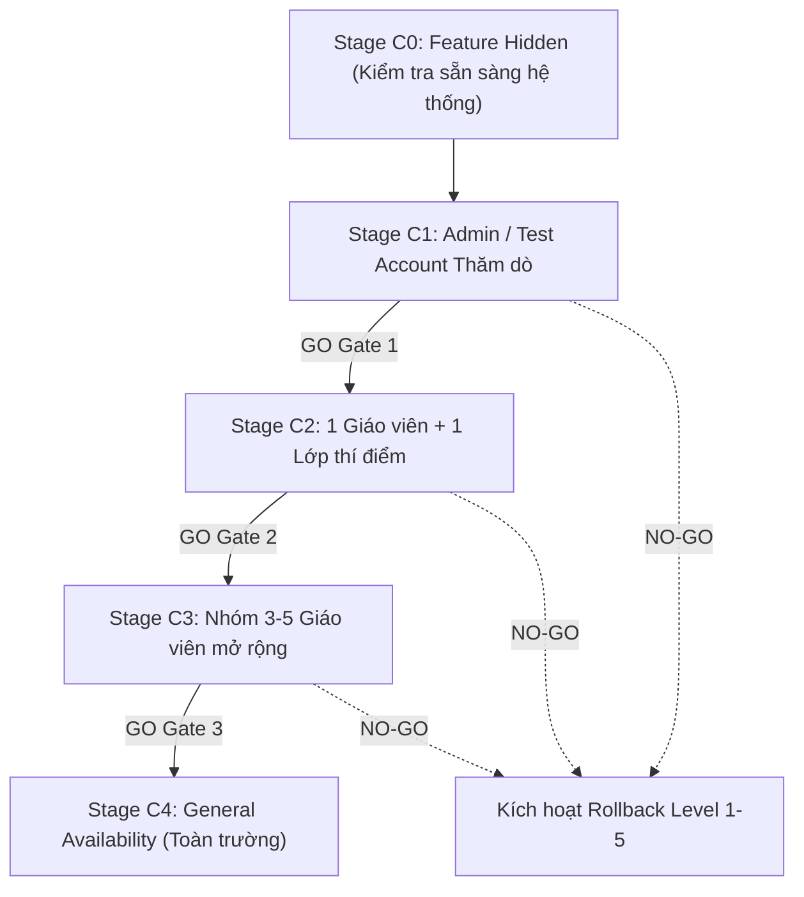

# 📘 SCORM PRODUCTION RELEASE RUNBOOK & CANARY DEPLOYMENT PLAN

> **Tài liệu quy trình chuẩn (SOP - Standard Operating Procedure) cho việc phát hành module SCORM và quản lý Migration CMI Persistence.**
> **Trạng thái tài liệu:** KẾ HOẠCH PHÁT HÀNH & ĐỒNG BỘ VERSION CONTROL (RELEASE PLAN - KHÔNG THỰC THI TỰ ĐỘNG)

---

## 1. NGUYÊN TẮC PHÁT HÀNH & HIỆN TRẠNG (RELEASE PRINCIPLES)

```text
LOCAL_VALIDATION         = PASS (100% PGlite, Unit, Integration & Build Tests)
MAIN_FRONTEND_STATUS     = COMPLETED & STABLE (PR #28 - PR #34 đã hoàn thiện Frontend/Player)
PR82_STATUS              = CLEAN REPLACEMENT (Thay thế PR #27, đồng bộ Migration & Tests)
HOSTED_PRODUCTION_REF    = szptvqkoiphrhlionfoh
PRODUCTION_DATA_PRESENT  = YES (4 dòng tracking thực tế đang hoạt động an toàn)
```

### 🔴 Nguyên tắc cốt lõi:
1. **Bảo tồn mã nguồn Frontend/Player trên `main`:** Mã nguồn giao diện và SCORM Player trên `main` hiện tại đã bao gồm đầy đủ các bản vá iSpring Resume Stuck Detector (PR #34), `handleSafeClose` (PR #33), iframe popups (PR #32) và MIME normalization (PR #28-#30). PR #82 chỉ bổ sung Migration baseline, bộ test và Runbook mà không can thiệp hay đè ngược frontend.
2. **Fail-Closed & Stop-on-Error:** Bất kỳ bước kiểm tra nào phát hiện lỗi (Gate Failure) đều kích hoạt dừng khẩn cấp và thực hiện quy trình Rollback tương ứng.
3. **Bảo vệ dữ liệu người dùng (Non-Destructive Rollback):** Tuyệt đối không xóa bảng `scorm_tracking_data` hoặc phá hủy 4 bản ghi dữ liệu học tập thực tế đang hoạt động trên Production.

---

## 2. PHẠM VI ĐỐI TƯỢNG TRONG MIGRATION 20260914152658

File migration `supabase/migrations/20260914152658_scorm_cmi_persistence_baseline.sql` quản lý toàn bộ các đối tượng cơ sở dữ liệu sau:

| Loại đối tượng | Tên đối tượng | Mục đích & Ranh giới bảo mật |
| :--- | :--- | :--- |
| **Guard** | `Precondition Fail-Fast Guard` | Chặn đứng việc chạy DDL đè lên database đã có sẵn baseline objects |
| **Table** | `public.scorm_tracking_data` | Bảng lưu trữ CMI state (RPC-ONLY, RLS locked khỏi public/anon/auth) |
| **Index** | `idx_scorm_tracking_user_package` | Index tối ưu truy vấn theo `(user_id, package_id)` |
| **Index** | `idx_scorm_tracking_material_user` | Index tối ưu truy vấn theo `(material_id, user_id)` |
| **Policy** | `scorm_tracking_service_role_all` | Policy RLS cho phép `service_role` truy cập toàn quyền |
| **Function** | `public._scorm12_time_to_seconds(text)` | Hàm tiện ích chuyển đổi thời gian SCORM 1.2 sang giây |
| **Function** | `public._seconds_to_scorm12_time(numeric)` | Hàm tiện ích chuyển đổi giây sang thời gian SCORM 1.2 |
| **Function** | `public._scorm2004_time_to_seconds(text)` | Hàm tiện ích chuyển đổi ISO 8601 Duration SCORM 2004 sang giây |
| **Function** | `public._seconds_to_scorm2004_time(numeric)` | Hàm tiện ích chuyển đổi giây sang ISO 8601 Duration SCORM 2004 |
| **RPC** | `public.load_scorm_cmi_state(uuid, text)` | `SECURITY DEFINER`: Nạp trạng thái CMI của học sinh theo session |
| **RPC** | `public.save_scorm_cmi_state(uuid, jsonb, text)` | `SECURITY DEFINER`: Lưu trạng thái CMI có xác thực token & validation |
| **RPC** | `public.resolve_scorm_session_asset(text)` | `SECURITY DEFINER`: Xác thực session token và trả tracking cho Edge Gateway |

---

## 3. HƯỚNG DẪN TRIỂN KHAI THEO 2 MÔI TRƯỜNG

### Kịch bản A: Cơ sở dữ liệu mới hoàn toàn (Fresh Database / Local Dev / CI)
1. Chạy migration theo luồng Supabase CLI tiêu chuẩn:
   ```bash
   npx supabase db reset
   # hoặc
   npx supabase migration up
   ```
2. Migration `20260914152658` sẽ vượt qua Precondition Guard và khởi tạo toàn bộ bảng, indexes, RLS policies và RPCs.
3. Chạy bộ kiểm thử CMI:
   ```bash
   node scripts/test_scorm_cmi_persistence.js
   ```
   Tất cả 32 test cases phải đạt kết quả PASS 100%.

### Kịch bản B: Cơ sở dữ liệu Hosted Production hiện tại (`szptvqkoiphrhlionfoh`)
1. **Hiện trạng xác minh:** Production đã có đầy đủ bảng `public.scorm_tracking_data` và các RPCs đang phục vụ dữ liệu trực tiếp.
2. **Tuyệt đối không chạy DDL lại:** Không chạy `supabase db push` hay chạy file SQL trực tiếp vì Precondition Guard sẽ kích hoạt ngoại lệ fail-fast để bảo vệ dữ liệu.
3. **Quy trình đồng bộ History (Cần phê duyệt riêng):**
   Sau khi kiểm tra đối chiếu schema Production khớp với migration, quản trị viên thực hiện đồng bộ lịch sử migration bằng lệnh:
   ```bash
   supabase migration repair 20260914152658 --status applied
   ```
   *Lưu ý:* Lệnh này CHỈ đánh dấu version `20260914152658` là đã áp dụng trong bảng `supabase_migrations.schema_migrations`, không thực thi bất kỳ câu lệnh DDL nào lên database.

---

## 4. KẾ HOẠCH PHÂN KỲ CANARY ROLLOUT (STAGES C0 – C4)



| Giai đoạn | Đối tượng áp dụng | Mục tiêu kiểm chứng | Điều kiện GO / NO-GO |
| :--- | :--- | :--- | :--- |
| **Stage C0** | *Toàn bộ người dùng* | Triển khai mã nguồn và DB nhưng ẩn UI SCORM | Database, Gateway và Player Host online an toàn. |
| **Stage C1** | *1 Tài khoản Admin / Tester nội bộ* | Tải lên 1 gói SCORM mẫu nhỏ (< 2MB), chạy đủ flow nạp/lưu CMI | Không phát sinh lỗi console, CMI lưu chuẩn, Edge Function 200. |
| **Stage C2** | *1 Giáo viên + 1 Lớp học nhỏ* | Giáo viên tải bài giảng thật, học sinh học và hoàn thành | Tiến độ lưu chính xác, không xung đột concurrent, resume tốt. |
| **Stage C3** | *Nhóm 3–5 Giáo viên* | Kiểm tra đa dạng gói SCORM (Articulate Storyline, iSpring, Adobe Captivate) | Dung lượng package đa dạng, tải mượt mà, không nghẽn Gateway. |
| **Stage C4** | *Toàn bộ Nhà trường (GA)* | Mở rộng tính năng cho toàn bộ giáo viên và học sinh | Hệ thống ổn định trong 72h, tỷ lệ lỗi < 0.01%. |

---

## 5. CHECKLIST SAO LƯU & AN TOÀN TRƯỚC PHÁT HÀNH

- [ ] **Database Snapshot:** Tạo bản sao lưu toàn bộ cơ sở dữ liệu Supabase Production trước khi thực hiện bất kỳ thay đổi nào.
- [ ] **Ghi nhận Git HEAD hiện tại:** Lưu trữ mã SHA của nhánh `main` trước khi merge.
- [ ] **Ghi nhận Vercel Production Deployment:** Lưu ID và URL của bản build Production hiện tại.
- [ ] **Kiểm tra Object Inventory:** Đối chiếu catalog, schema, function definitions, owner, grants và RLS policies.
- [ ] **Smoke Test SCORM:** Xác nhận phiên học SCORM 1.2 và SCORM 2004 tải và lưu tiến độ bình thường trên máy kiểm thử.
